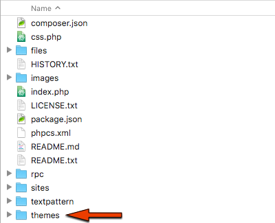
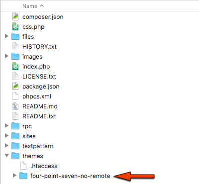
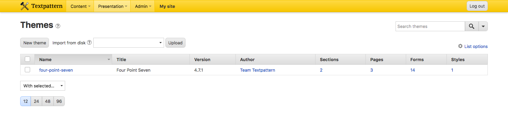
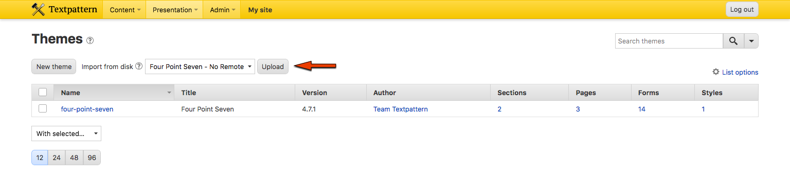
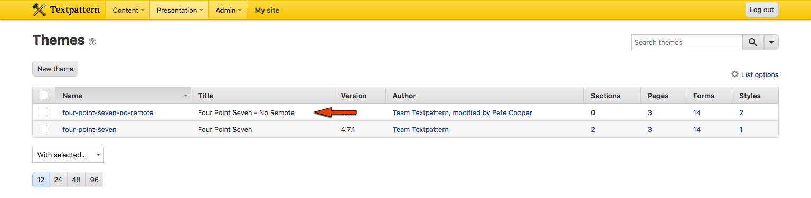
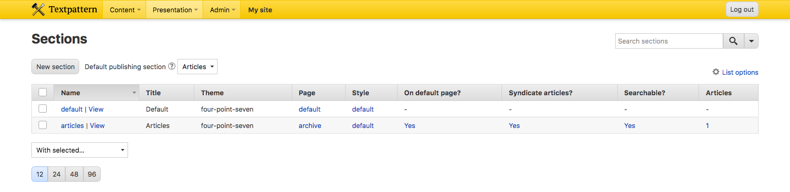
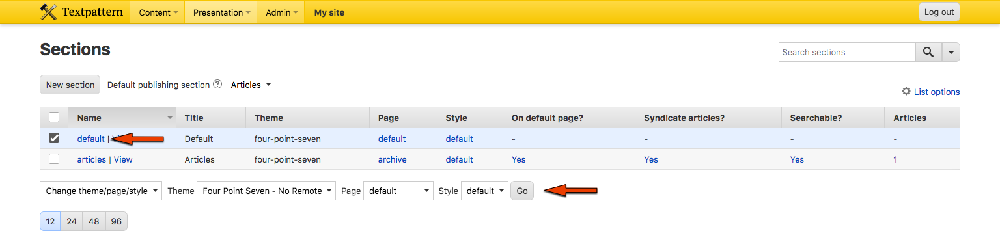

*Please note: this repo is deprecated. Textpattern default theme no longer uses Google Fonts.*

## Overview

This is a slightly modified version of the [Textpattern CMS default theme](https://github.com/textpattern/textpattern-default-theme) for Textpattern 4.7. It aims to be visually identical to the original but replace all remote assets with locally-available versions.

### Requirements

* Textpattern 4.7
* Textpattern Publisher privileges
* web server upload privileges (to the `themes` directory)

### Modifications

This modified theme is more suited for offline or firewalled servers, and also where [Content Security Policy](https://en.wikipedia.org/wiki/Content_Security_Policy) directives restrict access to remote assets.

The associated font files ([PT Serif](https://en.wikipedia.org/wiki/PT_Fonts), weights 400 & 700 in `EOT`, `SVG`, `TTF`, `WOFF` and `WOFF2` formats) are included in the theme.

Textpattern page and form scaffolds have been updated to serve fonts from the Textpattern site and are _not_ served from [Google Fonts](https://fonts.google.com):

```
<!-- Localised font stylesheet (replaces Google font API below) -->
<link rel="stylesheet" href="<txp:page_url type="theme_path" />/styles/fonts.css">

<!-- Original Google font API -->
<!-- <link rel="stylesheet" href="https://fonts.googleapis.com/css?family=PT+Serif:400,400i,700,700i&amp;subset=latin-ext"> -->
```

### Font loading preference

If the font is installed on the user's device, it will be used in preference to the font file included in the theme and the user's browser will not download a font file.

If the font is _not_ installed on the user's device, it will be served from the Textpattern site in the most appropriate format for the user's browser.

## Installation

This installation walkthrough is intended for English language Textpattern instances, the Textpattern user interface text referred to will differ in non-English languages.

Ensure you and your Textpattern site meet the requirements outlined above.

Download the theme as an archive, and extract the files to your device.

Navigate to the `themes` directory on your device, and locate the `four-point-seven-no-remote` directory inside.

Navigate to the `themes` directory on your Textpattern server with your preferred file uploader.



Upload the `four-point-seven-no-remote` to the `themes` directory on your Textpattern server.



Confirm the contents of the `four-point-seven-no-remote` directory on your device match your Textpattern server. This is usually a formality if your file transfer reports a successful upload.

From the Textpattern admin-side, navigate to the Themes panel using Presentation &rarr; Themes.



Locate the 'Import From Disk' dropdown, select 'Four Point Seven - No Remote' then use the Upload button to add it to the available themes.



Confirm the addition of the new theme 'Four Point Seven - No Remote' in the Themes list.



Navigate to the Sections panel using Presentation &rarr; Sections.



Check the `default` section checkbox. Locate the 'With selected…' dropdown menu and select the 'Change theme/page/style' entry. Three new inline dropdown menus will appear.

From the 'Theme' dropdown, select 'Four Point Seven - No Remote'. From the 'Page' dropdown, select 'default'. From the 'Style' dropdown, select 'default'. Use the 'Go' button to apply these changes.



For each other section in the Sections list, note the Page and Style column values then repeat the 'Change theme/page/style' process above for each section, ensuring the existing Page and Style column values are maintained.

The 'Four Point Seven - No Remote' theme is now installed and applied.

## Legal

PT Serif is included with an SIL Open Font License.
