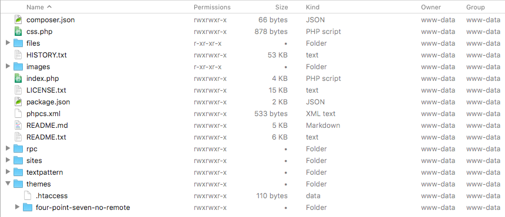
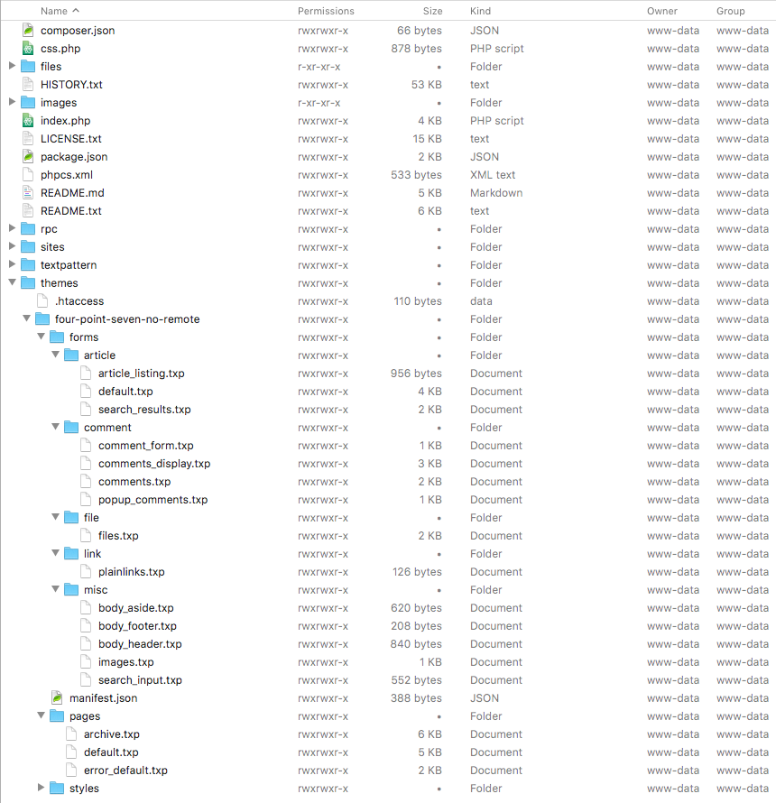
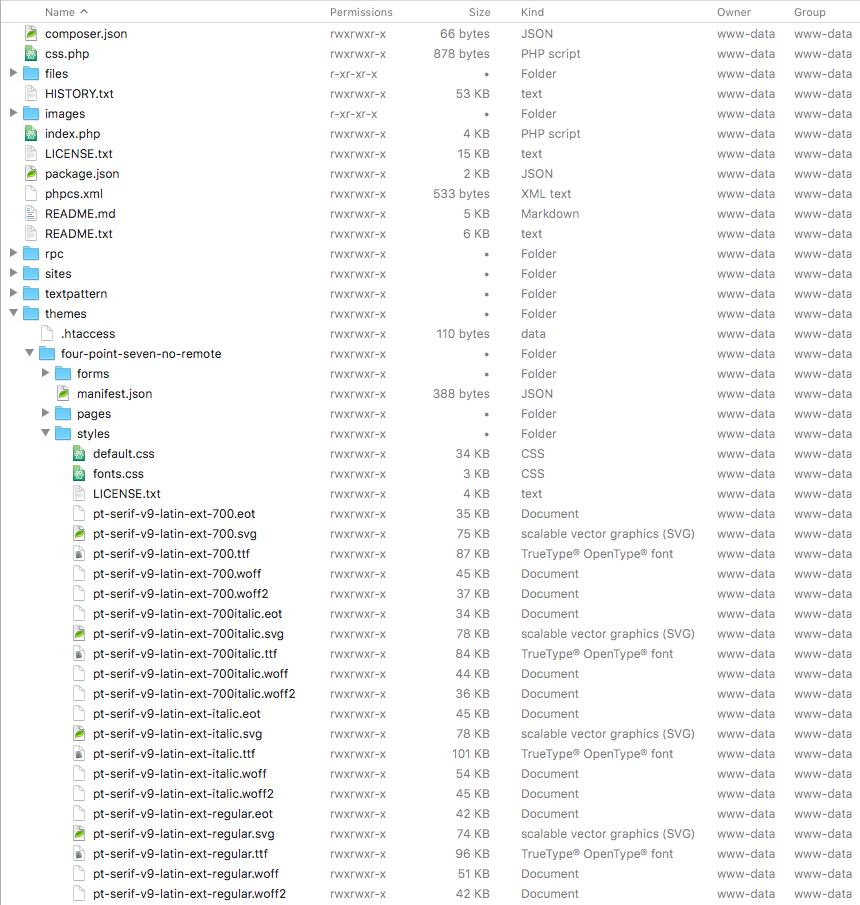

## Overview

This is a slightly modified version of the [Textpattern CMS default theme](https://github.com/textpattern/textpattern-default-theme). It aims to be visually identical to the original but replace all remote assets with locally-available versions.

### Requirements

* Textpattern 4.7.0 or newer
* Textpattern Publisher privileges
* web server upload privileges (to the `themes` directory)

### Modifications

This modified theme is more suited for offline or firewalled servers, and also where [Content Security Policy](https://en.wikipedia.org/wiki/Content_Security_Policy) directives restrict access to remote servers.

The associated font files ([PT Serif](https://en.wikipedia.org/wiki/PT_Fonts), weights 400 & 700 in `EOT`, `SVG`, `TTF`, `WOFF` and `WOFF2` formats) are included in the theme download. Textpattern page and form scaffolds have been updated to serve fonts from the Textpattern site and are _not_ served from [Google Fonts](https://fonts.google.com):

```
<!-- Localised font stylesheet (replaces Google font API below) -->
<link rel="stylesheet" href="<txp:page_url type="theme_path" />/styles/fonts.css">

<!-- Original Google font API -->
<!-- <link rel="stylesheet" href="https://fonts.googleapis.com/css?family=PT+Serif:400,400i,700,700i&amp;subset=latin-ext"> -->
```

### Font loading preference

If the font is installed on the user's device, it will be used in preference to the font file included in the theme and the user's browser will not download a font file.

If the font is _not_ installed on the user's device, it will be served from the Textpattern site in the most appropriate format for the user's browser.

## Installation

Ensure you and your Textpattern site meet the requirements outlined above.

Download the theme as an archive, and extract it to your device.

Navigate to the `themes` directory on your device, and locate the `four-point-seven-no-remote` directory inside.

Navigate to the `themes` directory on your Textpattern server.

Upload the `four-point-seven-no-remote` to the `themes` directory on your Textpattern server.

After the upload has completed, ensure the server directory structure passes the following checks. This should be a formality if the upload completed successfully, but if you are new to Textpattern themes this is a useful exercise.

* the `themes` directory contains a `four-point-seven-no-remote` directory.



* the `four-point-seven-no-remote` directory contains three directories: `forms`, `pages` and `styles`.

* the `forms` and `pages` directories contain the files listed below.



* the `styles` directory contain the files listed below.



From the Textpattern admin-side, visit the Themes panel using Presentation &rarr; Themes.


## Legal

PT Serif is included with an SIL Open Font License.
